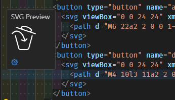
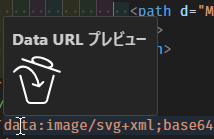

# SVG Preview on code

An extension to preview SVG on the editor of VS Code.

VS Codeのエディター上でSVGをプレビューするための拡張です。

## Features

Bring the mouse cursor over the SVG present in the editor to see a preview.

エディターに存在するSVGの上にマウスカーソルを持っていくとプレビューを表示します。



In addition, data scheme URLs are also supported.

ついでにdataスキームURLにも対応しています。



## Extension Settings

This extension contributes the following settings:

このエクステンションは以下の設定に対応しています。

- `svg-preview-on-code.preset`:

  Attributes that are set by default for svg elements.

  If there are properties that are reflected even if they are not specified in the attribute due to CSS or other reasons, they should be described.

  svg要素にデフォルトで設定される属性です。

  CSSなどにより属性に指定していなくても反映されるプロパティがあれば記述します。

  For example, if you specify the following in CSS:

  たとえばCSSで以下のように指定している場合:

  ```css
  svg {
    fill: none;
    stroke: currentColor;
    stroke-width: 2;
    stroke-linecap: round;
    stroke-linejoin: round;
  }
  ```

  If you specify the following in `svg-preview-on-code.preset`, it will be displayed almost like the actual one:

  `svg-preview-on-code.preset`に以下のように指定するとほぼ実際のものと同じように表示されます。

  ```json
  "svg-preview-on-code.preset": {
    "fill": "none",
    "stroke": "currentColor",
    "stroke-width": "2",
    "stroke-linecap": "round",
    "stroke-linejoin": "round"
  }
  ```

- `svg-preview-on-code.size`:

  Specifies the size of the preview. If omitted, the image will be displayed in its original size as much as possible.

  プレビューのサイズを指定します。省略時にはできるだけ元の画像のサイズで表示します。

- `svg-preview-on-code.currentColor`

  Specifies the color to draw the area in the svg where currentColor is specified.

  svg内でcurrentColorが指定された箇所を描画する色を指定します。

  省略した場合、ダークモードのときには白、ライトモードのときには黒を使用します。

Click on the ⚙ icon below the preview to open these settings screens.

プレビューの下にある⚙のアイコンをクリックするとこれらの設定画面が開きます。
